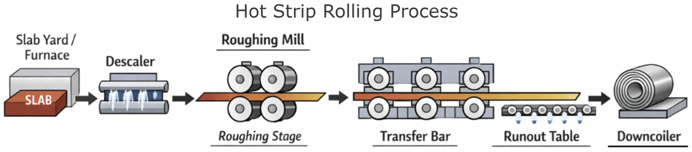
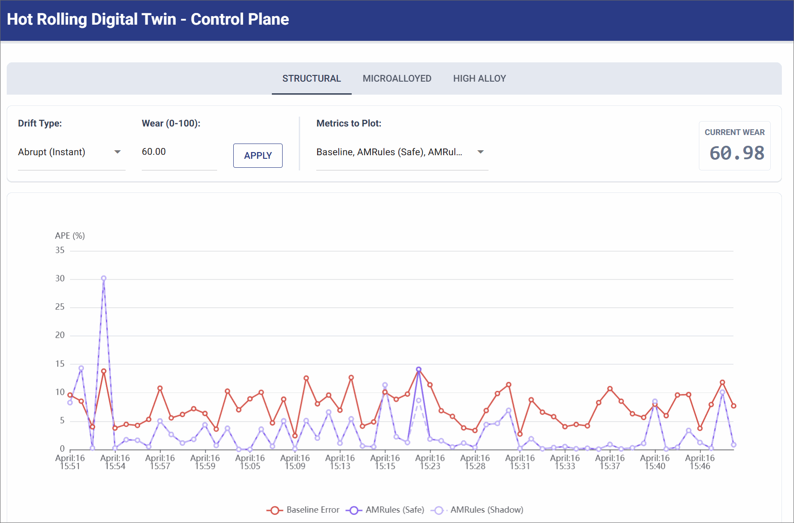
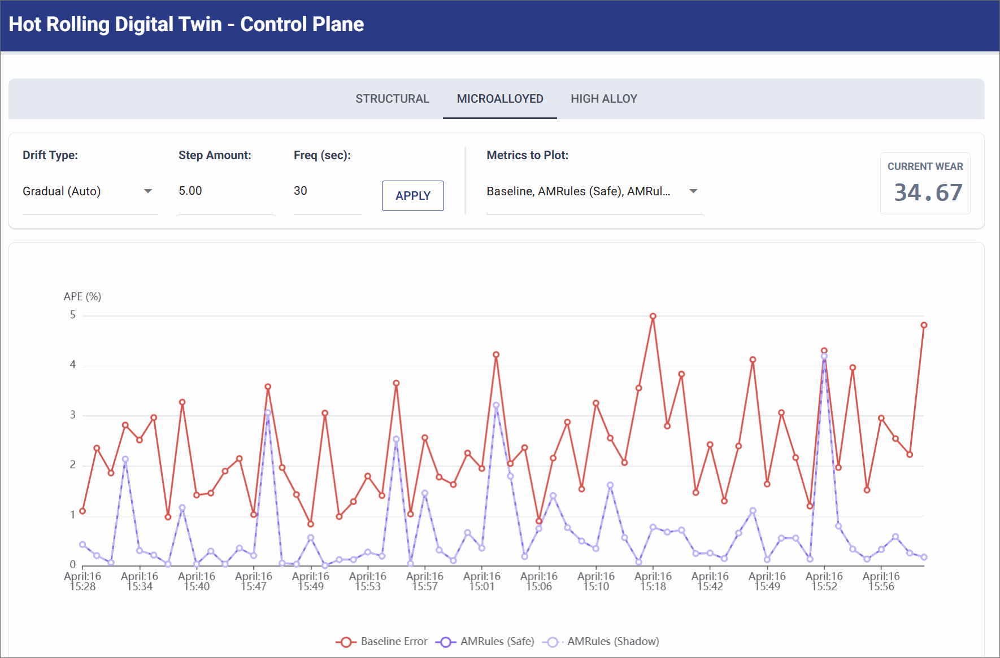
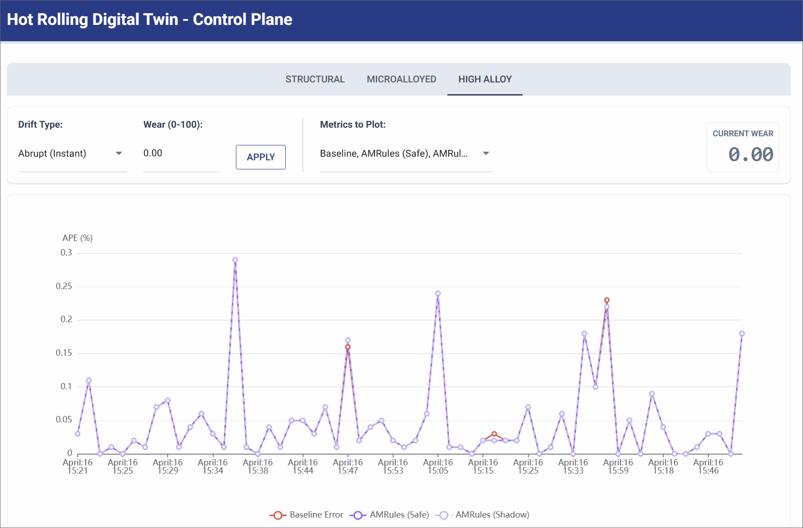

# Hot Strip Mill: Real-Time Online Machine Learning & Digital Twin

A real-time, fault-tolerant Online Machine Learning pipeline and Digital Twin for industrial Hot Strip Mill steel processing.

This system demonstrates how streaming architectures can be combined with Online Machine Learning to autonomously correct for physical **Concept Drift** (mechanical wear) in heavy industrial machinery, all while operating safely behind a deterministic **Shadow Mode Router**.

---

## 💡 What is Hot Strip Rolling?

Imagine using a rolling pin to flatten out a thick piece of dough. A Hot Strip Mill does the exact same thing, but with glowing red-hot steel slabs (often heated over 1000°C) and massive mechanical rollers. The steel is passed through a series of these rollers, crushing it down from a thick block into a long, thin sheet.

Calculating the exact **Rolling Force** required to crush the steel is critical. If the machine pushes too hard, it can severely damage the rollers; if it doesn't push hard enough, the steel doesn't reach the target thickness. Because the rollers are constantly grinding against raw steel, their physical shape slowly degrades over time. As the machinery wears down, the legacy mathematical formulas used to predict that perfect force slowly become inaccurate. This physical degradation is the root of the **Concept Drift** our real-time ML pipeline is solving.

<p align="center">
  
</p>

---

## 🛠️ Tech Stack

- **Apache Flink:** Distributed stream processing engine.
- **Kotlin:** Programming language used to build the Flink streaming application.
- **Apache Kafka:** Event message broker and streaming backbone.
- **ClickHouse:** Real-time OLAP database for dashboard metrics.
- **MOA (Massive Online Analysis):** An open-source Java framework for data stream mining, powering the core ML algorithms.
- **Python / NiceGUI / ECharts:** Powers the Digital Twin simulation and the interactive control plane dashboard.

---

## 🏗️ High-Level System Architecture

The architecture consists of three main components:

1.  **Digital Twin Simulation (Python):** Using the [Dynamic DES](https://github.com/jaehyeon-kim/dynamic-des) package, it simulates the physical steel rolling process, applying simulated mechanical wear and sensor noise to generate realistic factory data.
2.  **Message Broker (Kafka):** Handles the asynchronous, high-throughput streaming. It acts as the central nervous system for prediction requests, delayed ground-truth target forces, and incoming simulation control variables (e.g., wear level updates) from the **Digital Twin Control Plane**.
3.  **Stream Processor (Flink):** The brain of the system. It aligns streams, trains the Online ML model dynamically, evaluates safety guardrails, and routes the final prediction.

<p align="center">
  
</p>

---

## 📉 Concept Drift & Online Residual Learning

In heavy industrial processes like steel hot rolling, deterministic physics formulas are used to predict the exact force required to deform a slab. However, these pure physics models fail over time because the physical rollers experience ongoing mechanical wear. As the machinery degrades, the actual force required drifts away from the theoretical physics prediction, a classic real-world example of **Concept Drift**.

To solve this, the system deploys an **Online Machine Learning model** that learns the _new_ physical reality of the worn machinery on the fly. Crucially, the ML models do not predict the absolute rolling force from scratch. Instead, they utilize **Residual Learning**, predicting the residual error (the difference between the theoretical formula and the actual physical force). Thus, the final prediction routed to the factory floor is:

`Final Force = Physics Baseline + ML Residual Prediction`

<p align="center">
  
</p>

To continuously evaluate model performance, the Flink pipeline integrates the **Massive Online Analysis (MOA)** framework to execute three online learning algorithms simultaneously. **AMRules** acts as our primary production model, while the other two serve as baselines for comparison:

### AMRules (Adaptive Model Rules)

Serving as the primary engine of the Shadow Mode Router, [AMRules](https://scispace.com/pdf/adaptive-model-rules-from-data-streams-1l7ti6t60h.pdf) is a state-of-the-art streaming rule learning algorithm built specifically for regression problems. Because industrial data streams are constantly evolving, AMRules relies on incremental learning to adapt to changes using minimal computational overhead.

It builds an ensemble of rules where the antecedent (the "IF" condition) filters based on a slab's physical attributes, and the consequent (the "THEN" outcome) calculates a linear combination of those attributes to minimize the target's mean squared error. The linear models within these rules are continuously trained using incremental gradient descent, updating weights via the Delta rule: $w_{i}\leftarrow w_{i}+\eta(\hat{y}-y)x_{i}$.

Crucially, to handle abrupt mechanical shocks, every single rule in AMRules is equipped with an online change detector utilizing a **Page-Hinkley test**. This test constantly monitors the prediction error. If it detects a sudden change in the underlying data distribution (such as a roller breaking), it immediately reacts by pruning obsolete rules from the set. This allows the model to rapidly converge on the new physical reality without being dragged down by historical bias.

### Baseline Models

**Target Mean (Hybrid EWMA):** The simplest adaptive approach. It maintains an Exponentially Weighted Moving Average (EWMA) of the pure physics baseline's recent errors and applies it as a flat bias offset to the next prediction. While extremely fast, it strictly acts as an intercept shift and struggles to map complex, multivariate relationships.

**SGD (Stochastic Gradient Descent):** A lightweight, continuous linear regressor. Unlike offline batch models, this SGD tracks streaming weights and biases, updating itself incrementally on every single slab using standard scaled inputs (Z-Scores). It adjusts its weights based on the continuous residual error, allowing it to map linear multivariate drift, but it fails to rapidly capture abrupt, non-linear physical shocks.

<details>
  <summary><strong>Click to see data dictionary</strong></summary>

### Identifiers (Metadata)

These are used for routing, joining streams (Event A and B), and dashboard tracking.

- **`slab_id`** (String): Unique identifier for the steel block.
- **`pass_number`** (Integer): The current rolling pass (e.g., 1 through 7).
- **`steel_grade`** (String): Material classification (e.g., "structural", "microalloyed", "high_alloy").
- **`routing_key`** (String): Composite key used for Flink state partitioning to ensure ML models remain strictly isolated by product line.

### Raw Features (From Machine Sensors & Plant DB)

These are the exact 13 base parameters derived from Table 2 of [Thakur, S. K., et al. (2023)](https://www.sciencedirect.com/science/article/pii/S2949917823000445).

- **`reheating_time_min`** (Float): Time the slab spent in the furnace.
- **`roll_diameter_mm`** (Float): Physical diameter of the work rolls.
- **`roll_crown_mm`** (Float): The slight barrel-shape curve of the rolls to compensate for bending.
- **`entry_thickness_mm`** (Float): Thickness of the slab _before_ this pass.
- **`width_mm`** (Float): Width of the steel slab.
- **`length_mm`** (Float): Length of the steel slab.
- **`temperature_c`** (Float): Surface temperature of the steel at entry.
- **`speed_m_s`** (Float): Rolling speed of the mill.
- **`wait_time_sec`** (Float): Inter-pass time since the previous roll.
- **`reduction_pct`** (Float): The percentage of thickness being crushed in this pass.
- **`strain`** (Float): The total plastic deformation of the steel.
- **`strain_rate`** (Float): The speed at which the deformation occurs.
- **`flow_stress_mpa`** (Float): The internal resistance of the metal to being deformed.

### Engineered Features (Calculated on the fly in Flink)

Engineered features to instantly grasp non-linear physics.

- **`absolute_draft_mm`** (Float): `entry_thickness_mm * reduction_pct`.
  - The actual millimeters of steel being crushed. 10% of 200mm is vastly different physics than 10% of 20mm.
- **`temp_draft_interaction`** (Float): `absolute_draft_mm / temperature_c`.
  - Captures a crucial physical reality: crushing thick steel when it has cooled down requires exponentially massive force.
- **`volume_mm3`** (Float): `entry_thickness_mm * width_mm * length_mm`.
  - Gives the model an understanding of the total thermal mass.

### Line-Specific Simulation Features (Concept Drift Drivers)

These are the hidden physical state variables driving the concept drift. They are **strictly excluded** from the `PredictionRequestEvent` sent to the ML models so the algorithm cannot "cheat." They exist purely in the Python simulation to corrupt the Ground Truth physics. _(Note: They are published separately to the `sim-telemetry` Kafka topic so the UI Dashboard can plot the true hidden drift against the ML error rate)._

- **`wear_state_structural`** (Float): Kept at `0.0` to demonstrate stable baseline ML accuracy (No Drift).
- **`wear_state_microalloyed`** (Float): Automatically increments based on simulation clock time (`sim_ts`) to demonstrate continuous Flink model adaptation (Gradual Drift).
- **`wear_state_high_alloy`** (Float): Subject to sudden spikes triggered via the `sim-config` Kafka topic to demonstrate violent mechanical shocks (Abrupt Drift).

### Target Variables (Predictions and Actuals)

- **`baseline_roll_force_kn`** (Float): The legacy mathematical estimate (sent in Event A).
- **`actual_roll_force_kn`** (Float): The simulated physical reality, influenced by baseline physics, the hidden line-specific wear state, and Gaussian noise (sent in Event B).

### Evaluation Metrics (ClickHouse / Dashboard)

The Flink pipeline evaluates multiple models simultaneously and calculates the Absolute Percentage Error (APE) for each.

- **`baseline_ape`** (Float): The error of the pure physical formula.
- **`target_mean_ape`** (Float): A hybrid EWMA target mean tracker.
- **`sgd_ape`** (Float): Stochastic Gradient Descent ML error.
- **`am_rules_shadow_ape`** (Float): The "Raw Brain" error of the AMRules model. This tracks what the AI _wanted_ to do, regardless of whether it was safe.
- **`am_rules_ape`** (Float): The "Safe / Factory-Floor" error. Governed by the **Shadow Mode Router**, this value matches the AI's prediction when trusted, but snaps to the `baseline_ape` when the AI is caught hallucinating.

</details>

---

## 🏭 Data Generation: Digital Twin

To safely simulate this continuous industrial process, the Python-based Digital Twin utilizes the [Dynamic DES](https://github.com/jaehyeon-kim/dynamic-des) package to orchestrate a real-time simulation.

It is broken down into specific operational engines that map exactly to a physical factory floor:

- **Digital Twin Control Plane & Roll Drift Engine:** Operators use the web dashboard to manually inject mechanical wear or maintenance resets into the `sim-controls` Kafka topic. The internal **Roll Drift Engine** actively consumes these variables and updates the mill's condition, creating realistic **Concept Drift** on the fly.
- **Slab State Simulation:** Generates and tracks the physical transformation of the steel. As a slab moves through the virtual mill, this engine updates its core metallurgical properties (e.g., temperature drops, thickness reduction).
- **Mathematical Physics Engine:** Contains the strict mathematical formulas used by the factory. It calculates both the theoretical baseline force (what the math _thinks_ should happen) and the actual force (what _actually_ happens when wear penalties and sensor noise are applied).
- **Steel Hot Rolling Lifecycle Simulation:** The core orchestrator. It combines the slab features with the current wear level, asks the physics engine for the final force, and handles the asynchronous streaming. Crucially, it separates the outputs: first publishing a **Prediction Request** to Kafka, and later emitting the **Delayed Ground Truth** to simulate the physical delay of factory sensors.

<p align="center">
  
</p>

---

## ⚡ Stream Processing Topology (Apache Flink)

Industrial data streams are inherently asynchronous. Because the factory floor requests a prediction _before_ the steel is crushed, and the ground-truth sensor data arrives _after_ the steel is crushed, the Flink pipeline must ingest two separate Kafka topics (`mill-predictions` and `mill-groundtruth`) and reconstruct the lifecycle.

The topology executes this through a precise Directed Acyclic Graph (DAG):

1. **Stream Alignment & Latency Handling (`CoProcessFunction`):** The pipeline buffers incoming prediction requests in memory, waiting for the corresponding delayed ground-truth event from the factory sensors to arrive before joining them into a unified `MatchedEvent` payload.
   - **Synchronous Joining for Short Latency:** Because the physical delay between requesting a prediction and measuring the actual force is only a few seconds in a hot strip mill, Flink can safely buffer this short window. This enables a synchronized Test-then-Train evaluation and emits a clean, unified metric row to the dashboard.
   - **Adapting for High Latency:** If this were a process where ground truth took long to arrive (e.g., a physical metallurgy lab test), a synchronous join would block production. In that scenario, the architecture would decouple inference and training by immediately serving the prediction and saving the features into a long-TTL Flink state, then asynchronously training the model later when the ground truth finally streams in.

2. **Partitioning (`KeyBy` Steel Grade):** The unified stream is keyed by metallurgy type. This ensures that a separate, isolated Machine Learning model is maintained for every single steel grade. This strict state isolation prevents **catastrophic forgetting**, ensuring the model doesn't "forget" how to roll soft steel just because it spent the last three hours rolling high-carbon steel.

3. **Stateful Operator (`MoaEvaluationProcessFunction`):**
   This is the core execution block of the pipeline. For every matched event, it executes a strict **Test-then-Train** (prequential) paradigm:
   - **Load State:** Deserializes the specific AMRules model and EWMA tracking variables from Flink's `ByteArrayState` and `ValueState`.
   - **Test (Evaluate):** Before the model is allowed to "see" the ground truth, it makes a prediction on the incoming slab's features using its current, pre-update memory. This ensures we are measuring the model's true real-world accuracy.
   - **Online Learning (Train):** Immediately after making its prediction, the model compares its guess to the actual ground truth and updates its internal mathematical weights on the fly to minimize future residual errors.
   - **Shadow Scoring:** Calculates the new Exponentially Weighted Moving Average (EWMA) Trust Scores for both the pure physics baseline and the ML model to evaluate long-term reliability.
   - **Result Collector:** Emits a comprehensive `MoaEvaluationResult` payload containing the routing decision and Absolute Percentage Errors (APE).
   - **Save State:** Flushes the newly trained model back into Flink's managed state memory.

4. **Fault Tolerance & Custom MOA Checkpointing:**
   Because the ML models live entirely in memory during processing, they must be durably persisted to a State Backend (e.g., RocksDB) to prevent data loss. Flink achieves this through periodic, asynchronous distributed snapshots (checkpoints).

   MOA (`AMRules`) models, however, contain deeply complex, dynamic tree structures that often break Flink's default Kryo serializers during these snapshots. To solve this, the operator interacts with the MOA model as a standard Java object in memory for high-performance execution, but manually serializes it into a raw byte array (`ValueState<byte[]>`) upon every state update. When Flink's checkpoint coordinator triggers a snapshot barrier, it completely bypasses the complex object graph traversal and simply flushes these pre-serialized byte arrays directly to RocksDB. If a node fails, the system safely deserializes these bytes from the checkpoint, instantly restoring the exact computational brain-state of the ML models.

    <details>
      <summary><strong>Deep Dive: Serialization Performance Trade-off</strong></summary>

   <br/>
   Serializing a complex machine learning model into a byte array on every single event introduces a deliberate architectural trade-off between throughput and state safety.

   <br/>

   **Micro vs. Macro Latency**

   If we waited for Flink to trigger a checkpoint before serializing the model (for example, using the `snapshotState()` method), Flink would halt processing to traverse the massive MOA object graph. This creates a severe "Stop-The-World" pause on the main thread. In industrial control systems, a massive latency spike can cause hydraulic actuators to miss their physical timing windows. By pre-serializing the model into a simple byte array during normal processing, we pay a tiny micro-latency tax on every event, but we guarantee that the asynchronous checkpointing phase is lightning fast and never times out.

   **Throughput Limits and the Garbage Collection Wall**

   The cost of this stability is raw throughput. Continuously generating megabytes of raw byte arrays heavily taxes the Java Virtual Machine Garbage Collector. Sustained throughput on a single CPU core is effectively hard-capped around 100 to 200 records per second before Garbage Collection thrashing freezes the pipeline. However, the reality of industrial physics provides a safety net here. Even in a massive facility operating dozens of rolling machines simultaneously, the physical constraints of moving heavy steel keep the data velocity manageable. A single production line processes only a handful of slabs per second. Because Flink partitions the data streams by machine or product line, the load is distributed horizontally. Each parallel Flink worker operates well below its performance ceiling, making this approach extremely safe and stable for heavy manufacturing.

   **Scaling to High-Frequency Throughput (50,000+ RPS)**

   If this exact pipeline were ported to an Ad-Tech or High-Frequency Trading environment processing hundreds of thousands of events per second, this serialization approach would instantly fail. To achieve that scale, the architecture would require advanced Flink optimizations:
   - **State Deconstruction:** Breaking the MOA tree apart and storing individual node weights in Flink's native `MapState` to enable incremental RocksDB checkpoints.
   - **Custom TypeSerializers:** Writing a bare-metal Flink serializer to pack primitive data types directly, bypassing standard Java reflection entirely.
   - **Object Reuse:** Enabling Flink's `enableObjectReuse()` configuration to overwrite a single memory address, dropping object creation and Garbage Collection overhead down to zero.

    </details>

    <br/>

5. **ClickHouse Sink:** The final metrics are streamed into an OLAP database (ClickHouse) to power the real-time evaluation dashboard.

<p align="center">
  
</p>

---

## 🛡️ Safety & Fault Tolerance: Shadow Mode Router

Industrial Machine Learning cannot operate without strict safety boundaries. A model error that generates excessive rolling force could severely damage a multi-million-dollar rolling stand or create a major production bottleneck in the factory.

To mitigate this, the Flink pipeline implements a deterministic **Shadow Mode Router**. Every prediction generated by the Online ML model must pass through two strict programmatic guardrails before it is allowed to influence the factory floor:

1. **Guardrail A: Absolute Mechanical Limits (Stateless Check)**
   This is a hard, physical boundary check on the _current_ prediction. The router calculates the residual difference between the model's requested force and the physics baseline. If the model requests a force that deviates asymmetrically beyond safe bounds, for example, demanding **> +25%** (which risks crushing/breaking the rollers) or **< -20%** (which risks under-pressing the steel), the model's prediction is immediately rejected.

2. **Guardrail B: Algorithmic Trust Score (Stateful Check)**
   Even if a prediction is physically safe, the router must ask: _Is the model currently behaving reliably?_ Using an Exponentially Weighted Moving Average (EWMA), the router constantly tracks the recent Absolute Percentage Error (APE) of both the model and the pure physics model. If the model begins drifting and its moving average error trails the physics baseline by a defined margin (the Trust Deficit), the model is flagged as "untrusted" and benched.

**Fallback Mechanism:** If _either_ guardrail triggers, the router safely discards the model's prediction and routes the deterministic Physics Baseline to the factory floor instead.

Crucially, when the model is rejected, it is not turned off. It continues to process the data stream and train in the background (**Shadow Mode**). Once it learns the new physical reality of the factory and its EWMA Trust Score improves, the router automatically approves it to take control again.

<p align="center">
  
</p>

---

## ⏱️ Throughput & Latency

_This pipeline is designed to operate continuously, smoothly handling the asynchronous nature of factory floor sensor data._

- **Event Generation Rate (~2.4 Slabs/sec):** The Python Digital Twin simulates the factory at an accelerated continuous rate, writing roughly 2.4 prediction requests (`mill-predictions`) and 2.4 delayed actuals (`mill-groundtruth`) to Kafka every second.
- **Stream Alignment & Physical Delay:** The Flink consumer group maintains an exceptionally healthy, low lag (averaging ~26 messages). This small buffer perfectly absorbs the simulated physical time delay, representing the seconds it takes for a slab of steel to physically travel through the rolling mill before the ground-truth sensors record the final force.
- **Processing Throughput:** Flink continuously consumes the aligned streams at ~4.3 reads/second, successfully matching the asynchronous events, executing the MOA prequential training loop, and sinking the metrics to ClickHouse in near real-time with zero backpressure.

### 🎛️ Scaling the Simulation Throughput

If you want to increase the simulation throughput and generate a higher volume of events, you can tweak the [`SimParameter` configuration](./sim_control/generator.py#L51) in the Digital Twin.

To successfully increase the events per second (EPS) pushed to Kafka, you must adjust two operational parameters in tandem:

1.  **Increase the Ingestion Load (Arrival Rates):** Increase the `rate` values inside the `arrival` dictionary. This makes the synthetic furnace eject new slabs of steel much faster (e.g., changing structural from `0.2` to `2.0`).
2.  **Increase the Factory Throughput (Capacity or Service Times):** If you pump more steel into the mill, the virtual machines need more processing power to prevent a backlog. You must either:
    - Increase the `current_cap` in the `resources` dictionary to simulate adding more parallel rolling lines (e.g., bumping capacity from `4` to `10`).
    - Decrease the `mean` durations in the `service` dictionary to simulate the rollers running at much faster physical speeds.

---

## 🚀 Getting Started

Follow these steps to run the complete Digital Twin, Kafka, Flink, and Dashboard pipeline locally on your machine.

### Prerequisites

- **Docker & Docker Compose**
- **Java JDK 11** (Required to build the Flink application)
- **Python 3.10+** (Required for the Digital Twin and Dashboard)
- **Factor House Community License:** [See instructions here](https://github.com/factorhouse/factorhouse-local?tab=readme-ov-file#update-kpow-and-flex-licenses) to obtain your free license file.

---

### Step 1: Preparation

First, clone the [Factor House Local](https://github.com/factorhouse/factorhouse-local) repository, and optionally download the necessary connector dependencies. Then, build the Flink application.

```bash
# Clone the Factor House Local Infrastructure
git clone git@github.com:factorhouse/factorhouse-local.git

# (Optional) Download Kafka connect, Flink connector jars ...
./factorhouse-local/resources/setup-env.sh

# Build the Flink application (Shadow JAR)
cd steel-rolling-oml-processor
./gradlew shadowJar
cd ..

# Verify the Flink JAR file
ls steel-rolling-oml-processor/build/libs/
# Expected: steel-rolling-oml-processor-1.0.jar
```

### Step 2: Start Environment

Export your Kpow/Flex license variables and spin up the infrastructure using Docker Compose. If you are using the Community editions of Kpow and Flex, you only need a single license file.

This step deploys the following stack:

- **Kafka (`compose-kpow.yml`):** A 3-node Kafka cluster, Kafka Connect, Schema Registry, and Kpow. Kpow is used for managing Kafka and is available at [http://localhost:3000](http://localhost:3000).
- **Flink (`compose-flex.yml`):** A Flink cluster with a single JobManager and three TaskManagers, alongside Flex. Flex is used for managing Flink and is available at [http://localhost:3001](http://localhost:3001).
- **ClickHouse (`compose-store.yml`):** The OLAP database sink, exposed at [http://localhost:8123](http://localhost:8123). _(Database: `dev` | Username: `default`)_.

```bash
# Export edition and license variables (Community Edition)
export KPOW_SUFFIX="-ce"
export FLEX_SUFFIX="-ce"
export KPOW_LICENSE=~/.license/community/license.env
export FLEX_LICENSE=~/.license/community/license.env

# Spin up Kafka, Flink, and ClickHouse via Docker Compose
docker compose -p kpow -f ./factorhouse-local/compose-kpow.yml up -d \
  && docker compose -p flex -f ./factorhouse-local/compose-flex.yml up -d \
  && docker compose -p store --profile clickhouse -f ./factorhouse-local/compose-store.yml up -d
```

### Step 3: Start Simulation

Set up your Python environment and start the Digital Twin generator. This will immediately begin simulating the steel rolling process and publishing events to Kafka.

```bash
# Set up a virtual environment and install dependencies
python3 -m venv venv
source venv/bin/activate
pip install -r requirements.txt

# Start the Data Generator (Digital Twin)
python sim_control/generator.py
```

### Step 4: Deploy Flink App

With data flowing into Kafka, deploy the compiled Flink pipeline to the JobManager to start the Online Machine Learning processing.

```bash
# Copy the compiled JAR into the Flink JobManager container
docker cp steel-rolling-oml-processor/build/libs/steel-rolling-oml-processor-1.0.jar \
  jobmanager:/tmp/steel-rolling-oml-processor-1.0.jar

# Submit the job to the Flink cluster (Detached mode)
# Parallelism is set to 3 to match the 3 partitions in the Kafka topics.
docker exec jobmanager /opt/flink/bin/flink run -d -p 3 \
  /tmp/steel-rolling-oml-processor-1.0.jar
```

### Step 5: Start Control Plane

Finally, open a **new terminal**, reactivate your virtual environment, and launch the NiceGUI Dashboard to monitor the metrics and inject mechanical wear into the simulation. It will be available at [http://localhost:8080](http://localhost:8080).

```bash
source venv/bin/activate
python sim_control/dashboard.py
```

### Step 6: Tear Down Environment

When you are finished, you can stop the foreground Python dashboard by hitting `Ctrl + C`.

Then, clean up the Docker containers and unset your environment variables:

```bash
docker compose -p store --profile clickhouse -f ./factorhouse-local/compose-store.yml down \
  && docker compose -p flex -f ./factorhouse-local/compose-flex.yml down \
  && docker compose -p kpow -f ./factorhouse-local/compose-kpow.yml down

unset KPOW_SUFFIX FLEX_SUFFIX KPOW_LICENSE FLEX_LICENSE
```

---

## 🎮 Simulation Scenarios

Using the NiceGUI Dashboard, you can actively manipulate the physical state of the Digital Twin to observe the Flink pipeline's reaction in real-time.

_(Note: While the baseline models (Target Mean and SGD) are not visualized in the GIFs below, their continuous evaluation metrics are tracked under the hood and described in the observations.)_

### Scenario A: Abrupt Drift (Mechanical Shock)

Simulates a sudden mechanical failure (e.g., a roller bearing breaking), instantly altering the physics of the mill.

- **Simulation Settings:** Trigger Abrupt Shock (Wear Level: 60.0).
- **Observation:** The pure physics baseline error instantly spikes and remains high (often \>10% APE) because the physical reality no longer matches the math. The primary **AMRules** model initially spikes alongside it, but its Page-Hinkley change detector immediately drops obsolete rules, allowing it to rapidly converge back to lower error as it learns the new broken state.
- **Baseline Models:** **Target Mean** and **SGD** struggle significantly with the non-linear shock, experiencing massive error spikes (exceeding 35-40% APE) before slowly stabilizing. They lack the rule-pruning agility of AMRules.

<p align="center">
  
</p>

### Scenario B: Gradual Drift (Standard Wear)

Simulates the continuous, bi-directional cycle of slow roller degradation and subsequent maintenance recovery over hours of production.

- **Simulation Settings:** Gradual Wear (Step Size: 5.0, Frequency: 30 seconds).
- **Observation:** The physics baseline error slowly and persistently creeps upward/download over time (e.g. ranging from 2% to 7% APE) as the wear level drifts gradually. The **AMRules** model gracefully tracks this changing reality, updating its linear weights incrementally to maintain a smooth error rate.
- **Baseline Models:** **SGD** maps the linear drift decently but experiences occasional lag, while the **Target Mean** (EWMA) struggles with periodic volatility (spiking up to 20-30% APE) as it over-corrects for the changing drift.

<p align="center">
  
</p>

### Scenario C: No Drift (Pristine State)

Simulates a pristine factory state, such as immediately after a maintenance shift replaces the rollers.

- **Simulation Settings:** Wear Level: 0.0.
- **Observation:** The physical reality of the factory floor perfectly aligns with the deterministic mathematical formulas. The physics baseline maintains a highly accurate, near-zero error rate (\< 0.3% APE). **AMRules** remains stable under this condition.
- **Baseline Models:** Both **Target Mean** and **SGD** remain stable as well, which correctly identifying the absence of residual error and avoiding unnecessary adjustments or predictive noise.

<p align="center">
  
</p>

---

## 📚 References

- Almeida, E., Ferreira, C., & Gama, J. (2013). **Adaptive Model Rules from Data Streams**. _Machine Learning and Knowledge Discovery in Databases._
- Bifet, A., Holmes, G., Kirkby, R., & Pfahringer, B. (2010). **MOA: Massive Online Analysis**. _Journal of Machine Learning Research (JMLR)._
- Jung, C. (2019). **Data-Driven Optimization of Hot Rolling Processes**. _Dissertation, Technische Universität Dortmund_.
- Thakur, S. K., et al. (2023). **Application of machine learning methods for the prediction of roll force and torque during plate rolling of micro-alloyed steel**. _Journal of Alloys and Metallurgical Systems, 4_, 100044.
- Kim, J. (2026). **Dynamic DES**: A Python package for Dynamic Discrete Event Simulation.

---

## 📜 License

This project is licensed under the MIT License.
