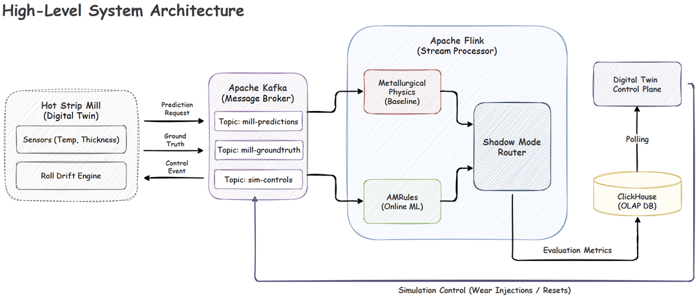
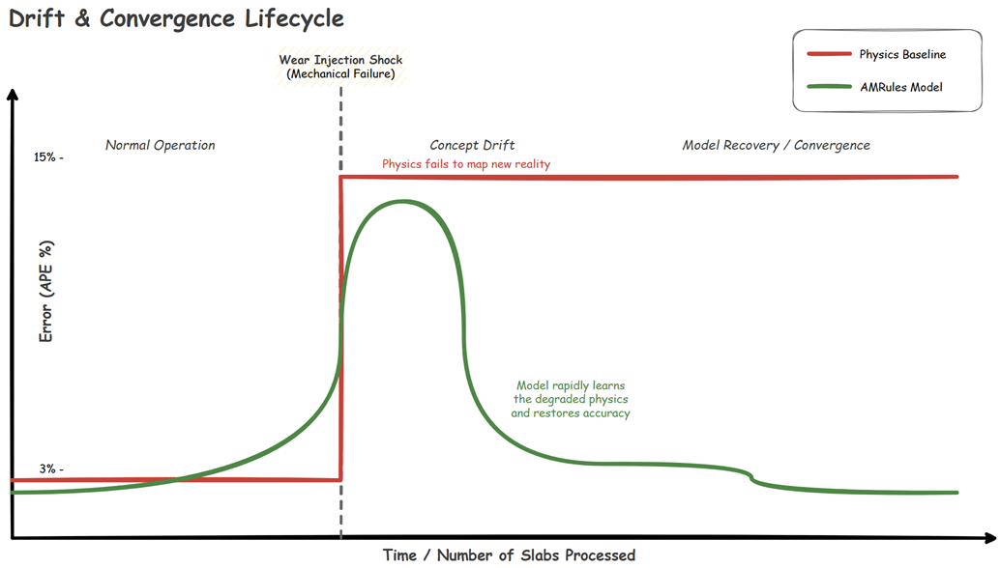
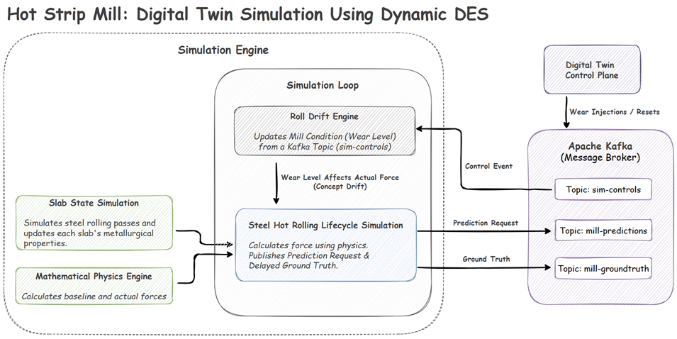
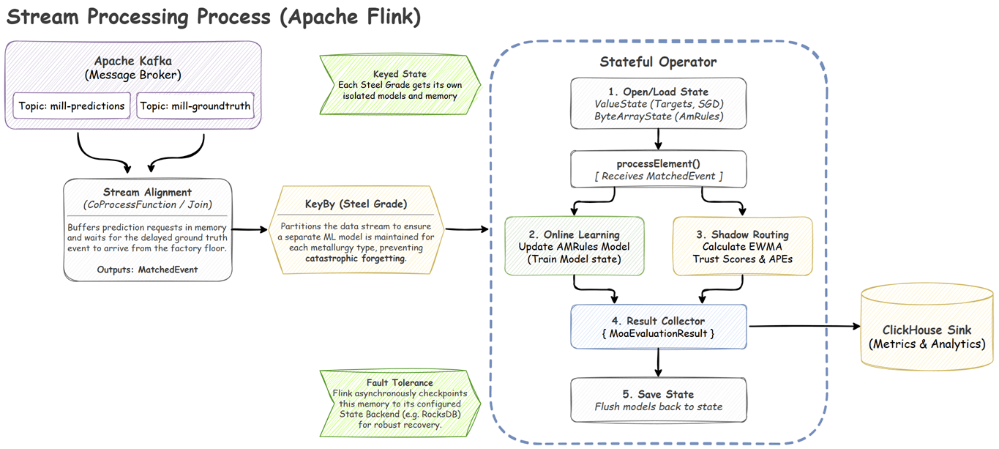
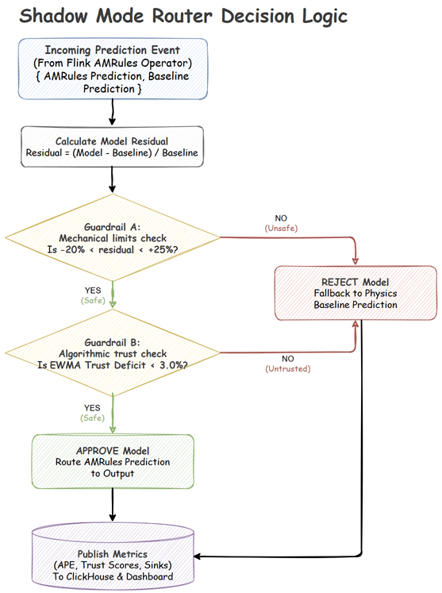

# Hot Strip Mill: Real-Time Online Machine Learning & Digital Twin

A real-time, fault-tolerant Online Machine Learning pipeline and Digital Twin for industrial Hot Strip Mill steel processing.

This system demonstrates how streaming architectures (Apache Flink + Kafka) can be combined with Online Machine Learning (e.g. [AMRules](https://scispace.com/pdf/adaptive-model-rules-from-data-streams-1l7ti6t60h.pdf)) to autonomously correct for physical **Concept Drift** (mechanical wear) in heavy industrial machinery, all while operating safely behind a deterministic **Shadow Mode Router**.

## 🏗️ High-Level System Architecture

The architecture consists of three main components:

1. **Digital Twin Simulation (Python):** Simulates the physical steel rolling process, applying simulated mechanical wear and sensor noise to generate realistic factory data.
2. **Message Broker (Kafka):** Handles the asynchronous, high-throughput streaming. It acts as the central nervous system for prediction requests, delayed ground-truth target forces, and incoming simulation control variables (e.g., wear level updates) from the **Digital Twin Control Plane**.
3. **Stream Processor (Flink):** The brain of the system. It aligns streams, trains the Online ML model dynamically, evaluates safety guardrails, and routes the final prediction.

<p align="center">
  
</p>

---

## 📉 Problem: Mechanical Wear & Concept Drift

In heavy industrial processes like steel hot rolling, deterministic physics formulas are used to predict the exact force required to deform a slab. However, these pure physics models fail over time because the physical rollers experience ongoing mechanical wear. As the machinery degrades, the actual force required drifts away from the theoretical physics prediction—a classic real-world example of **Concept Drift**.

By deploying an **Online Machine Learning model**—which trains continuously on a never-ending stream of new slab events rather than relying on static offline batches—the system learns the _new_ physical reality of the worn machinery on the fly. This actively bridges the gap between theoretical physics and degraded mechanical reality.

To solve this and continuously quantify our success, the Flink pipeline executes three online learning algorithms simultaneously. **AMRules** acts as our primary production model, while the other two serve as real-time baselines to mathematically prove the value of the advanced algorithm on our dashboard:

### AMRules (Adaptive Model Rules)

Serving as the primary engine of the Shadow Mode Router, AMRules is a state-of-the-art streaming rule learning algorithm built specifically for regression problems. Because industrial data streams are constantly evolving, AMRules relies on incremental learning to adapt to changes using minimal computational overhead.

It builds an ensemble of rules where the antecedent (the "IF" condition) filters based on a slab's physical attributes, and the consequent (the "THEN" outcome) calculates a linear combination of those attributes to minimize the target's mean squared error. The linear models within these rules are continuously trained using incremental gradient descent, updating weights via the Delta rule: $w_{i}\leftarrow w_{i}+\eta(\hat{y}-y)x_{i}$.

Crucially, to handle abrupt mechanical shocks, every single rule in AMRules is equipped with an online change detector utilizing a **Page-Hinkley test**. This test constantly monitors the prediction error. If it detects a sudden change in the underlying data distribution (such as a roller breaking), it immediately reacts by pruning obsolete rules from the set. This allows the model to rapidly converge on the new physical reality without being dragged down by historical bias.

### Baseline Models

**Target Mean (Hybrid EWMA):** The simplest adaptive approach. It maintains an Exponentially Weighted Moving Average (EWMA) of the pure physics baseline's recent errors and applies it as a flat bias offset to the next prediction. While extremely fast, it strictly acts as an intercept shift and struggles to map complex, multivariate relationships.

**SGD (Stochastic Gradient Descent):** A lightweight, continuous linear regressor. Unlike offline batch models, this SGD tracks streaming weights and biases, updating itself incrementally on every single slab using standard scaled inputs (Z-Scores). It adjusts its weights based on the continuous residual error, allowing it to map linear multivariate drift, but it fails to rapidly capture abrupt, non-linear physical shocks.

<details>
  <summary>Click to see data dictionary</summary>

### Identifiers (Metadata)

These are used for routing, joining streams (Event A and B), and dashboard tracking.

- **`slab_id`** (String): Unique identifier for the steel block.
- **`pass_number`** (Integer): The current rolling pass (e.g., 1 through 7).
- **`steel_grade`** (String): Material classification (e.g., "structural", "microalloyed", "high_alloy").
- **`routing_key`** (String): Composite key used for Flink state partitioning to ensure ML models remain strictly isolated by product line.

### Raw Features (From Machine Sensors & Plant DB)

These are the exact 13 base parameters derived from Table 2 of the [reference paper](https://www.sciencedirect.com/science/article/pii/S2949917823000445).

- **`reheating_time_min`** (Float): Time the slab spent in the furnace.
- **`roll_diameter_mm`** (Float): Physical diameter of the work rolls.
- **`roll_crown_mm`** (Float): The slight barrel-shape curve of the rolls to compensate for bending.
- **`entry_thickness_mm`** (Float): Thickness of the slab _before_ this pass.
- **`width_mm`** (Float): Width of the steel slab.
- **`length_mm`** (Float): Length of the steel slab.
- **`temperature_c`** (Float): Surface temperature of the steel at entry.
- **`speed_m_s`** (Float): Rolling speed of the mill.
- **`wait_time_sec`** (Float): Inter-pass time since the previous roll.
- **`reduction_pct`** (Float): The percentage of thickness being crushed in this pass.
- **`strain`** (Float): The total plastic deformation of the steel.
- **`strain_rate`** (Float): The speed at which the deformation occurs.
- **`flow_stress_mpa`** (Float): The internal resistance of the metal to being deformed.

### Engineered Features (Calculated on the fly in Flink)

Engineered features to instantly grasp non-linear physics.

- **`absolute_draft_mm`** (Float): `entry_thickness_mm * reduction_pct`.
  - The actual millimeters of steel being crushed. 10% of 200mm is vastly different physics than 10% of 20mm.
- **`temp_draft_interaction`** (Float): `absolute_draft_mm / temperature_c`.
  - Captures a crucial physical reality: crushing thick steel when it has cooled down requires exponentially massive force.
- **`volume_mm3`** (Float): `entry_thickness_mm * width_mm * length_mm`.
  - Gives the model an understanding of the total thermal mass.

### Line-Specific Simulation Features (Concept Drift Drivers)

These are the hidden physical state variables driving the concept drift. They are **strictly excluded** from the `PredictionRequestEvent` sent to the ML models so the algorithm cannot "cheat." They exist purely in the Python simulation to corrupt the Ground Truth physics. _(Note: They are published separately to the `sim-telemetry` Kafka topic so the UI Dashboard can plot the true hidden drift against the ML error rate)._

- **`wear_state_structural`** (Float): Kept at `0.0` to demonstrate stable baseline ML accuracy (No Drift).
- **`wear_state_microalloyed`** (Float): Automatically increments based on simulation clock time (`sim_ts`) to demonstrate continuous Flink model adaptation (Gradual Drift).
- **`wear_state_high_alloy`** (Float): Subject to sudden spikes triggered via the `sim-config` Kafka topic to demonstrate violent mechanical shocks (Abrupt Drift).

### Target Variables (Predictions and Actuals)

- **`baseline_roll_force_kn`** (Float): The legacy mathematical estimate (sent in Event A).
- **`actual_roll_force_kn`** (Float): The simulated physical reality, influenced by baseline physics, the hidden line-specific wear state, and Gaussian noise (sent in Event B).

### Evaluation Metrics (ClickHouse / Dashboard)

The Flink pipeline evaluates multiple models simultaneously and calculates the Absolute Percentage Error (APE) for each.

- **`baseline_ape`** (Float): The error of the pure physical formula.
- **`target_mean_ape`** (Float): A hybrid EWMA target mean tracker.
- **`sgd_ape`** (Float): Stochastic Gradient Descent ML error.
- **`am_rules_shadow_ape`** (Float): The "Raw Brain" error of the AMRules model. This tracks what the AI _wanted_ to do, regardless of whether it was safe.
- **`am_rules_ape`** (Float): The "Safe / Factory-Floor" error. Governed by the **Shadow Mode Router**, this value matches the AI's prediction when trusted, but snaps to the `baseline_ape` when the AI is caught hallucinating.

</details>

<br/>

<p align="center">
  
</p>

---

## 🏭 Data Generation: Digital Twin

To safely simulate this continuous industrial process, the Python-based Digital Twin utilizes the [Dynamic DES](https://github.com/jaehyeon-kim/dynamic-des) package to orchestrate a real-time, time-stepped simulation loop.

The digital twin is broken down into specific operational engines that map exactly to a physical factory floor:

- **Digital Twin Control Plane & Roll Drift Engine:** Operators use the web dashboard to manually inject mechanical wear or maintenance resets into the `sim-controls` Kafka topic. The internal **Roll Drift Engine** actively consumes these variables and updates the mill's condition, creating realistic **Concept Drift** on the fly.
- **Slab State Simulation:** Generates and tracks the physical transformation of the steel. As a slab moves through the virtual mill, this engine updates its core metallurgical properties (e.g., temperature drops, thickness reduction).
- **Mathematical Physics Engine:** Contains the strict mathematical formulas used by the factory. It calculates both the theoretical baseline force (what the math _thinks_ should happen) and the actual force (what _actually_ happens when wear penalties and sensor noise are applied).
- **Steel Hot Rolling Lifecycle Simulation:** The core orchestrator. It combines the slab features with the current wear level, asks the physics engine for the final force, and handles the asynchronous streaming. Crucially, it separates the outputs: first publishing a **Prediction Request** to Kafka, and later emitting the **Delayed Ground Truth** to simulate the physical delay of factory sensors.

<p align="center">
  
</p>

---

## ⚡ Stream Processing Topology (Apache Flink)

Industrial data streams are inherently asynchronous. Because the factory floor requests a prediction _before_ the steel is crushed, and the ground-truth sensor data arrives _after_ the steel is crushed, the Flink pipeline must ingest two separate Kafka topics (`mill-predictions` and `mill-groundtruth`) and reconstruct the lifecycle.

The topology executes this through a precise Directed Acyclic Graph (DAG):

1. **Stream Alignment (`CoProcessFunction`):** The pipeline buffers incoming prediction requests in memory. It waits for the corresponding delayed ground-truth event to arrive from the factory sensors, joining them together into a unified `MatchedEvent` payload.

2. **Partitioning (`KeyBy` Steel Grade):** The unified stream is keyed by metallurgy type. This ensures that a separate, isolated Machine Learning model is maintained for every single steel grade. This strict state isolation prevents **catastrophic forgetting**, ensuring the model doesn't "forget" how to roll soft steel just because it spent the last three hours rolling high-carbon steel.

3. **Stateful Operator (`MoaEvaluationProcessFunction`):**
   This is the core execution block of the pipeline. For every matched event, it executes a strict **Test-then-Train** (prequential) paradigm:
   - **Load State:** Deserializes the specific AMRules model and EWMA tracking variables from Flink's `ByteArrayState` and `ValueState`.
   - **Test (Evaluate):** Before the model is allowed to "see" the ground truth, it makes a prediction on the incoming slab's features using its current, pre-update memory. This ensures we are measuring the model's true real-world accuracy.
   - **Online Learning (Train):** Immediately after making its prediction, the model compares its guess to the actual ground truth and updates its internal mathematical weights on the fly to minimize future residual errors.
   - **Shadow Scoring:** Calculates the new Exponentially Weighted Moving Average (EWMA) Trust Scores for both the pure physics baseline and the ML model to evaluate long-term reliability.
   - **Result Collector:** Emits a comprehensive `MoaEvaluationResult` payload containing the routing decision and Absolute Percentage Errors (APE).
   - **Save State:** Flushes the newly trained model back into Flink's managed state memory.

4. **Fault Tolerance & Custom MOA Checkpointing:**
   Because the ML models live entirely in memory during processing, Flink must asynchronously checkpoint this state to a durable State Backend (e.g., RocksDB) to prevent data loss.

   However, MOA (`AmRules`) models contain deeply complex, dynamic tree structures that often break Flink's default Kryo serializers. To solve this, the operator manually serializes the MOA models into raw byte arrays (`ByteArrayState`) using Java's native `ObjectOutputStream` before saving. If a Flink node fails, the system safely deserializes these bytes and instantly restores the exact brain-state of the ML models from the last checkpoint.

5. **ClickHouse Sink:** The final metrics are streamed into an OLAP database (ClickHouse) to power the real-time evaluation dashboard.

<p align="center">
  
</p>

---

## 🛡️ Safety & Fault Tolerance: Shadow Mode Router

Industrial Machine Learning cannot operate without strict safety boundaries. A model hallucinating an extreme rolling force could severely damage a multi-million-dollar rolling stand or cause a catastrophic factory bottleneck.

To mitigate this, the Flink pipeline implements a deterministic **Shadow Mode Router**. Every prediction generated by the Online ML model must pass through two strict programmatic guardrails before it is allowed to influence the factory floor:

1. **Guardrail A: Absolute Mechanical Limits (Stateless Check)**
   This is a hard, physical boundary check on the _current_ prediction. The router calculates the residual difference between the model's requested force and the physics baseline. If the model requests a force that deviates asymmetrically beyond safe bounds, for example, demanding **> +25%** (which risks crushing/breaking the rollers) or **< -20%** (which risks under-pressing the steel), the model's prediction is immediately rejected.

2. **Guardrail B: Algorithmic Trust Score (Stateful Check)**
   Even if a prediction is physically safe, the router must ask: _Is the model currently behaving reliably?_ Using an Exponentially Weighted Moving Average (EWMA), the router constantly tracks the recent Absolute Percentage Error (APE) of both the model and the pure physics model. If the model begins drifting and its moving average error trails the physics baseline by a defined margin (the Trust Deficit), the model is flagged as "untrusted" and benched.

**Fallback Mechanism:** If _either_ guardrail triggers, the router safely discards the model's prediction and routes the deterministic Physics Baseline to the factory floor instead.

Crucially, when the model is rejected, it is not turned off. It continues to process the data stream and train in the background (**Shadow Mode**). Once it learns the new physical reality of the factory and its EWMA Trust Score improves, the router automatically approves it to take control again.

<p align="center">
  
</p>

---

## 🚀 Getting Started

_(Placeholder: Instructions for running the application)_

```bash
# Example Placeholder
docker-compose up -d
python3 -m venv venv
source venv/bin/activate
pip install -r requirements.txt
python src/generator.py
```

---

## 🎮 Simulation Scenarios in Action

Using the Python/ECharts Dashboard, you can actively manipulate the physical state of the Digital Twin to observe the Flink pipeline's reaction in real-time.

### Scenario A: Abrupt Drift (Mechanical Shock)

Simulates a sudden mechanical failure (e.g., a roller bearing breaking), instantly altering the physics of the mill.

- **How to simulate:** Click the `Trigger Abrupt Shock` button in the UI.
- **Observation:** The physics baseline error instantly spikes. The ML model spikes alongside it, but rapidly steps down and converges back to \<3% error as it learns the new broken state.

### Scenario B: Gradual Drift (Standard Wear)

Simulates the standard, slow degradation of the rollers grinding against red-hot steel over hours of production.

- **How to simulate:** Slowly increase the `Gradual Wear` slider in the UI.
- **Observation:** The physics baseline error slowly creeps upward over time. The ML model tracks the changing reality smoothly, preventing the creeping error from affecting production.

### Scenario C: No Drift (Baseline / Reset)

Simulates a pristine factory state, such as immediately after a maintenance shift replaces the rollers.

- **How to simulate:** Click `Reset Mill` or set Wear to 0%.
- **Observation:** Both the physics baseline and the ML model maintain a highly accurate, stable APE.

---

## 📜 License

This project is licensed under the MIT License.
